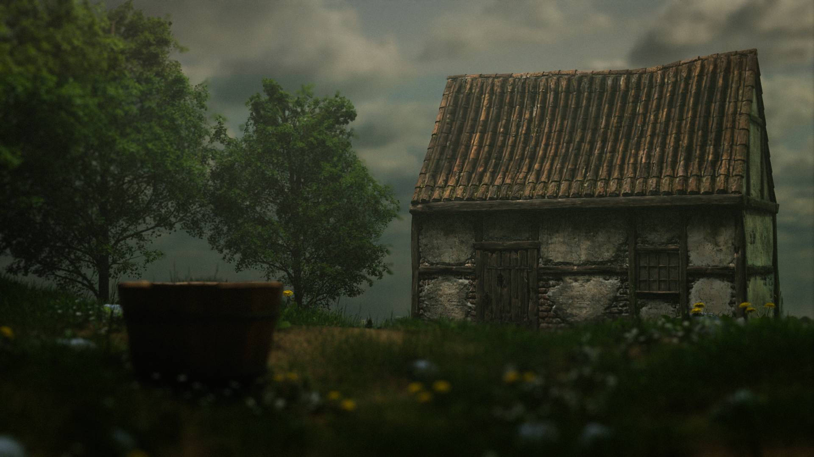

# Medieval Cottage Render

This render depicts a rustic medieval cottage surrounded by lush greenery. The model was created in Blender, and the scene was rendered using the Cycles render engine.

**Project Details:**

- **Software Used:** Blender 3.10
- **Render Engine:** Cycles
- **Inspiration:** This scene was inspired by traditional medieval architecture, focusing on creating a serene and realistic environment.
- **Techniques Used:** Modeling, texturing, and environmental lighting were key components in bringing this scene to life.

Feel free to explore the details of this render and reach out if you have any questions or feedback!
